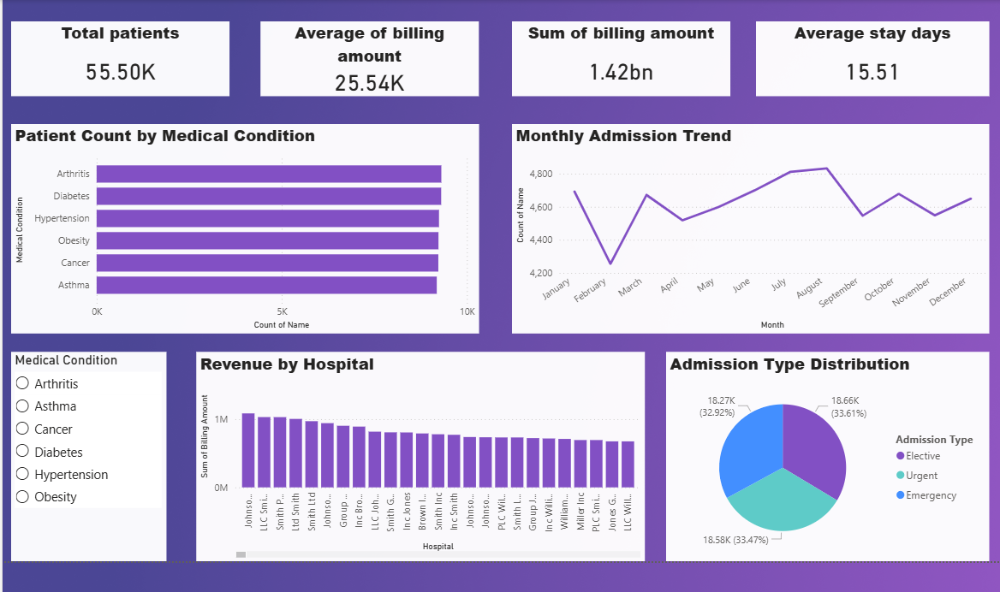

# 🏥 Healthcare Data Analysis Project

## 📌 Project Overview
This project performs end-to-end analysis on a real-world healthcare dataset using **PostgreSQL** for data analysis and **Power BI** for visualization. The goal is to uncover insights about patient admissions, billing patterns, medical conditions, and hospital performance.

---

## 📂 Dataset Information
| Detail | Info |
|--------|------|
| **File** | healthcare_dataset.csv |
| **Total Records** | 55,500 patients |
| **Total Columns** | 15 |

### Columns:
`Name`, `Age`, `Gender`, `Blood Type`, `Medical Condition`, `Date of Admission`, `Doctor`, `Hospital`, `Insurance Provider`, `Billing Amount`, `Room Number`, `Admission Type`, `Discharge Date`, `Medication`, `Test Results`

---

## 🛠️ Tools Used
- **Microsoft Excel** - Dataset exploration & CSV conversion
- **PostgreSQL** - Data Analysis & SQL Queries
- **pgAdmin 4** - Database Management
- **Power BI** - Dashboard & Visualization
- **Git & GitHub** - Version Control

---

## 🗄️ SQL Analysis
The SQL file covers the following concepts:

| Concept | Description |
|---------|-------------|
| SELECT, WHERE, ORDER BY | Basic filtering and sorting |
| Aggregate Functions | COUNT, SUM, AVG, MIN, MAX |
| GROUP BY & HAVING | Grouped analysis |
| CASE Statement | Age groups, billing categories |
| Subqueries | Nested queries for comparisons |
| Window Functions | RANK, PARTITION BY, LAG, LEAD |
| CTE | Common Table Expressions |

---

## 📊 Power BI Dashboard



### Dashboard Includes:
- **KPI Cards** - Total Patients, Average Billing, Total Revenue, Avg Stay Days
- **Bar Chart** - Patient Count by Medical Condition
- **Line Chart** - Monthly Admission Trend
- **Column Chart** - Revenue by Hospital
- **Pie Chart** - Admission Type Distribution
- **Slicer** - Filter by Medical Condition

---

## 🔍 Key Insights
- Total **55,500 patients** analyzed across multiple hospitals
- Average billing amount is **$25.54K** per patient
- Total hospital revenue is **$1.42 Billion**
- Average patient stay is **15.51 days**
- **Arthritis** has the highest patient count among all conditions
- Admission types are almost equally distributed — Elective (33.61%), Emergency (33.47%), Urgent (32.92%)
- Patient admissions peak around **August-September**

---

## 📁 Project Structure
```
healthcare_analysis/
│
├── healthcare_dataset.csv       # Raw dataset
├── healthcare_queries.sql       # SQL analysis queries
├── healthcare_analysis dashboard.pbix  # Power BI dashboard
├── dashboard.png                # Dashboard screenshot
└── README.md                    # Project documentation
```

---

## 👩‍💻 Author
**Pooja Kalshetty**  
Aspiring Data Analyst  
[GitHub](https://github.com/poojakalshetty-pixel)
